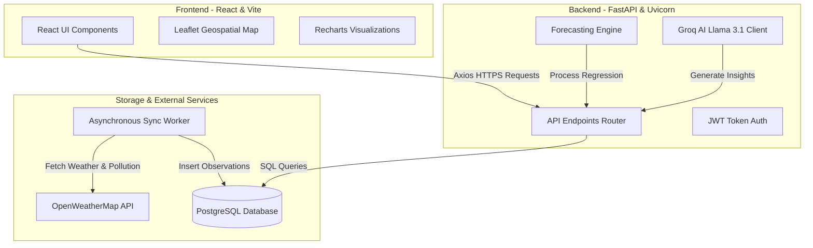

# UrbanSense - AI-Powered Urban Air Quality Intelligence Platform

UrbanSense is a real-time, geospatial environmental intelligence platform built for municipal command centers and urban planners. It aggregates air pollution metrics, visualizes them across municipal wards, generates weather-adjusted 24-hour predictive forecasts, and provides AI-driven policy recommendations to combat critical pollution spikes.

🔗 **Live Application:** [urbansense-eight.vercel.app](https://urbansense-eight.vercel.app)  

---

## 🛠️ Technology Stack
* **Frontend:** React, Vite, Leaflet (Map Visualization), Recharts (Analytical Charts), TailwindCSS
* **Backend:** FastAPI (Python), Uvicorn (ASGI Web Server), SQLAlchemy (ORM)
* **AI Engine:** Groq Cloud SDK (Llama 3.1 LLM)
* **Data Sources:** OpenWeatherMap API (Air Pollution & Weather Telemetry)

---

## 🌟 Key Features

### 🏢 Command Dashboard
* **City-Wide Aggregation:** Real-time averages of Air Quality Index (AQI) and active sensors calculated directly via optimized database queries.
* **Live Sync Tracker:** Visual indicator tracking background sensor synchronization progress.
* **Municipal Ward Rankings:** Live lists of municipal wards sorted by current status (Good, Satisfactory, Moderate, Poor, Very Poor).

### 🗺️ Geospatial Map View
* **Interactive Map:** Integrated Leaflet map showing municipal boundaries using GeoJSON shapes.
* **Dynamic Color-Coding:** Wards automatically change color based on their current real-time AQI levels.
* **Tooltip Telemetry:** Hovering over a ward shows coordinates, sensor statuses, and localized telemetry.

### 📈 Decision-Support Ward Profile & Forecasting
* **Current Metrics:** Hourly historical pollutant levels (PM2.5, PM10, NO2, CO, SO2, O3) and meteorological data (Temperature, Humidity, Wind).
* **24-Hour Predictive Forecast:** Time-aware linear regression model that projects future AQI trends, simulated with diurnal cycles and dampened using exponential decay.

### 🤖 AI-Powered Recommendations & Interventions
* **Decision Support System (DSS):** Real-time generation of target policy recommendations (e.g. traffic restrictions, graded construction bans).
* **Citizen Advisories:** Dynamic advisories generated for children, elderly, and outdoor workers.
* **Interventions Log:** Municipal logs tracking active policy implementations and measuring their localized impact over time.

---

## 📊 System Architecture



---

## ⚙️ Installation & Setup

### Prerequisites
* Python 3.10+
* Node.js 18+
* PostgreSQL Database
* OpenWeatherMap API Key
* Groq Cloud API Key

### Backend Setup
1. Navigate to the backend directory:
   ```bash
   cd backend
   ```
2. Create and activate a virtual environment:
   ```bash
   python -m venv venv
   source venv/bin/activate  # On Windows: venv\Scripts\activate
   ```
3. Install dependencies:
   ```bash
   pip install -r requirements.txt
   ```
4. Create a `.env` file in the backend root:
   ```env
   PROJECT_NAME="UrbanSense"
   DATABASE_URL="your_postgresql_connection_string"
   OPENWEATHER_API_KEY="your_openweathermap_api_key"
   GROQ_API_KEY="your_groq_api_key"
   ```
5. Seed the database:
   ```bash
   python scripts/seed_db.py
   ```
6. Start the FastAPI development server:
   ```bash
   uvicorn app.main:app --reload
   ```

### Frontend Setup
1. Navigate to the frontend directory:
   ```bash
   cd ../frontend
   ```
2. Install dependencies:
   ```bash
   npm install
   ```
3. Start the Vite development server:
   ```bash
   npm run dev
   ```

---

## 🤝 Contributing
Contributions are welcome! Please follow these steps to contribute:
1. Fork the repository.
2. Create a new branch: `git checkout -b feature/your-feature-name`.
3. Make your changes and commit them: `git commit -m 'Add some feature'`.
4. Push to the branch: `git push origin feature/your-feature-name`.
5. Open a Pull Request.

---

## 📄 License
This project is licensed under the MIT License - see the [LICENSE](LICENSE) file for details.
